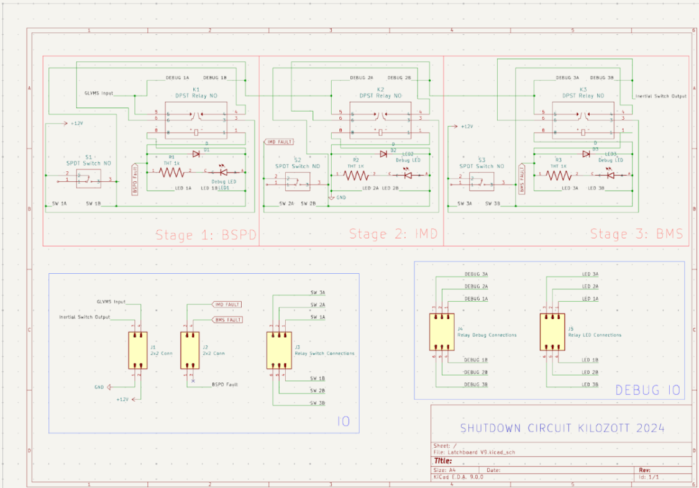
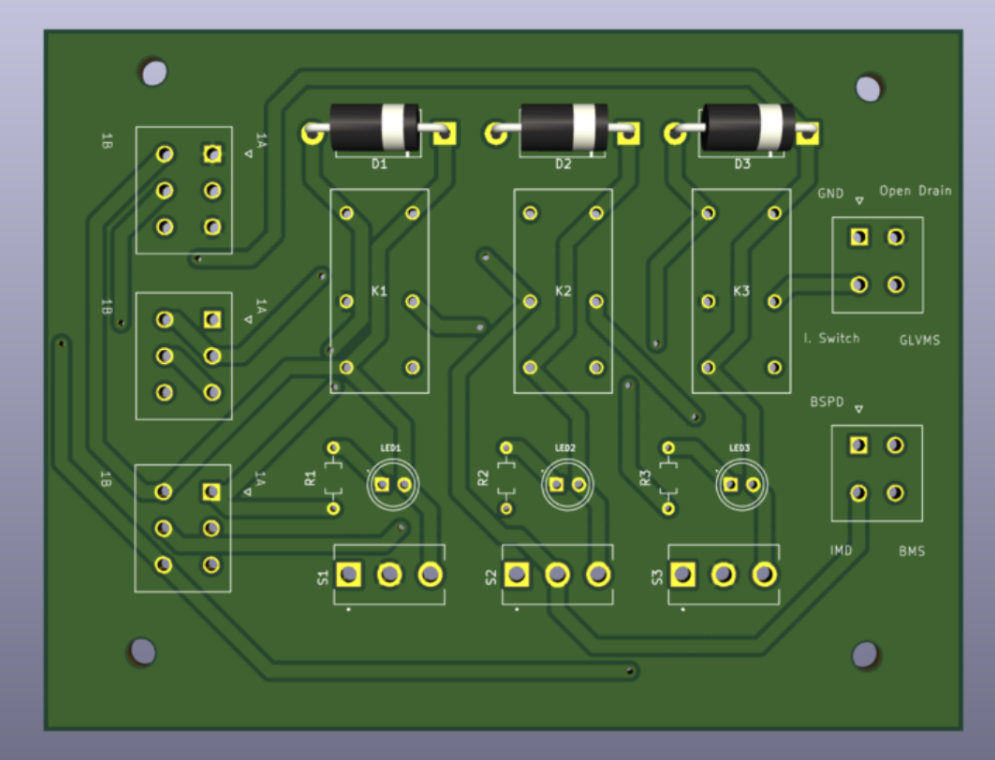

# Kilozott Electronics Build Book 2025

**Contributors:**

Click to expand

* Gabriel Schoene – ‘26 (gabeemail@email.com)
* Natalie Perrochon – ‘26 (perrochon.natalie@gmail.com)
* Albert Huang - '27 (alberyh1@uci.edu)

---

## Table of Contents

Click to expand

- [Team Overview](#team-overview)
  - [History](#history)
  - [Kilozott](#kilozott)
- [Electronics-Relevant Rules](#electronics-relevant-rules)
  - [Motivation](#motivation)
  - [Changes for 2026](#key-changes-for-2026)
  - [Important Rules](#global-relevant-rules)
- [Electronics Functionality](#electronics-functionality)
  - [System Overview](#system-overview)
  - [Brief Subsystem Overview](#brief-subsystem-overview)
- [Tractive System Operations](#tractive-system-operations)
  - [Accumulator Battery Pack](#accumulator-battery-pack)
  - [Precharge / Discharge Circuit](#precharge--discharge-circuit)
  - [High-Voltage Power Delivery Components](#high-voltage-power-delivery-components)
  - [Inverter](#inverter)
  - [Motor](#motor)
- [Tractive System Safety](#tractive-system-safety)
  - [Shutdown System](#shutdown-system)
  - [Shutdown Latch](#shutdown-latch)
  - [Brake System Plausibility Device](#brake-system-plausibility-device)
  - [Battery Management System](#battery-management-system)
  - [Insulation Monitoring Device](#insulation-monitoring-device)
  - [Emergency Stops & Switches](#emergency-stops--switches)
  - [Interlocks](#interlocks)
- [Driver Interface](#driver-interface)
  - [Tractive System Status Indicator](#tractive-system-status-indicator)
  - [Ready-to-Drive Sound](#ready-to-drive-sound)
  - [Dashboard & Displays](#dashboard--displays)
  - [Accelerator Pedal Position Sensors](#accelerator-pedal-position-sensors)
  - [Central Control Module](#central-control-module)
  - [Sensor Networks](#sensor-networks)
- [Harnessing and Power Distribution](#harnessing-and-power-distribution)
  - [GLV System](#glv-system)
  - [Power Distribution Board](#power-distribution-board)
  - [CAN Bus Communication](#can-bus-communication)
  - [Subsystem Wiring](#subsystem-wiring)
- [Cooling](#cooling)
  - [Cooling Components](#cooling-components)
- [Appendix](#appendix)

---

## Team Overview

### History

#### Kilozott
Kilozott is the competition car that was designed in the 2024-2025 cycle.

---

## Electronics-Relevant Rules

### Motivation
The car needs to be rules-compliant in order to race in the competition. Before the dynamic events, there are technical inspections that scrutinize every aspect of the car to ensure it is safe and adheres to the competition rules for that year. If any component fails, then the team is prohibited from racing. This includes a “rain test”, which sprays the car with water to ensure components are watertight.

Kilozott’s electronics were designed based on the 2024-2025 rules. Changes may be needed to become compliant with 2025-2026 rules.

**Download 2026 rules here:** [FSAE_Rules_2026_V1.pdf](BuildBookSupport/FSAE_Rules_2026_V1.pdf)

### Key Changes for 2026
> **ACTION ITEM:** Copy paste key changes and highlight differences. For each change explain what that might imply & link relevant sections.

### Global Relevant Rules
This is not a comprehensive list but rather cherry-picked for convenience. These rules apply to the entire electronics system. For circuit specific rules, refer to the detailed documentation sections below. 

To ensure complete compliance, always refer to the comprehensive FSAE rulebook.

#### Global Rule 1
> **[Content Placeholder]**

---

## Electronics Functionality

### System Overview
We break the electronics system down into 5 main categories that address different scopes of the overall functionality:

1.  Tractive System Operations
2.  Tractive System Safety
3.  Driver Interface
4.  Harnessing and Power Distribution
5.  Cooling

### Brief Subsystem Overview

<strong>Tractive System Operations</strong> – high-voltage power path from accumulator to motor.

Tractive System Operations covers every component used to deliver tractive energy from the accumulator to the inverter and ultimately to the motor.

- [Accumulator Battery Pack](#accumulator-battery-pack)
- [Precharge / Discharge Circuit](#precharge--discharge-circuit)
- [High-Voltage Power Delivery Components](#high-voltage-power-delivery-components)
- [Inverter](#inverter)
- [Motor](#motor)

<strong>Tractive System Safety</strong> – mandated protection, monitoring, and shutdown circuits.

Tractive System Safety includes all FSAE-required hardware that monitors, protects, or shuts down the tractive system when a fault occurs.

- [Shutdown System](#shutdown-system)
- [Shutdown Latch](#shutdown-latch)
- [Brake System Plausibility Device](#brake-system-plausibility-device)
- [Battery Management System](#battery-management-system)
- [Insulation Monitoring Device](#insulation-monitoring-device)
- [Emergency Stops & Switches](#emergency-stops--switches)
- [Interlocks](#interlocks)

<strong>Driver Interface</strong> – everything a driver touches, sees, or hears during operation.

Driver Interface spans the feedback and controls presented to the driver (TSSI, RTDS, dashboards, pedals, CAN-fed signals for brakes, accelerator, wheel speed, etc.).

- [Tractive System Status Indicator](#tractive-system-status-indicator)
- [Ready-to-Drive Sound](#ready-to-drive-sound)
- [Dashboard & Displays](#dashboard--displays)
- [Accelerator Pedal Position Sensors](#accelerator-pedal-position-sensors)
- [Central Control Module](#central-control-module)
- [Sensor Networks](#sensor-networks)

<strong>Harnessing & Power Distribution</strong> – GLV power, bus architecture, and wiring practices.

This category documents low-voltage power delivery, CAN distribution, and subsystem wiring conventions that keep signals reliable.

- [GLV System](#glv-system)
- [Power Distribution Board](#power-distribution-board)
- [CAN Bus Communication](#can-bus-communication)
- [Subsystem Wiring](#subsystem-wiring)

<strong>Cooling</strong> – thermal management for electronics and high-power components.

Cooling content and component list are still being developed.

- [Cooling Components](#cooling-components) *(to be completed)*

Detailed documentation for each area lives in the dedicated sections that follow.

---

## Tractive System Operations

<strong>Accumulator Battery Pack</strong>

Document pack layout, cell chemistry, critical sensors, and how tractive and GLV domains interface. Include links to schematics, AIR wiring, and service procedures.

#### Overview
> _To be completed._

#### Functionality
> _To be completed._

#### System Block Diagram
> _To be completed._

#### Schematic / PCB
> _To be completed._

#### Subcomponents
> _To be completed._

#### Key Design Decisions
> _To be completed._

#### Mechanical Interface
> _To be completed._

#### Testing Instructions
> _To be completed._

#### Notes for Iteration
> _To be completed._

<strong>Precharge / Discharge Circuit</strong>

Capture resistor sizing, timing logic, controller firmware, and test procedures that verify current ramps and discharge compliance.

#### Overview
The Precharge Board manages the critical startup sequence connecting high voltage (HV) from the accumulator to the inverter. Its primary purpose is to prevent massive inrush currents—which could weld contactors or damage components—by slowly charging the inverter’s large DC-link capacitors before the main Accumulator Isolation Relays (AIRs) close.

#### Functionality
**Startup Sequence:**
1.  **Initialization:** The car powers on; the PDB provides 12V to the system, and the Central Control Module (CCM) initiates communication via CAN.
2.  **Safety Check:** The Manual Service Disconnect (MSD) must be closed, and the Safety Daisy Chain (Shutdown Loop) must be intact to enable the board.
3.  **Voltage Monitoring:** The board continuously measures both the Accumulator voltage and the Tractive System (inverter) voltage.
4.  **Precharge Phase:** The board energizes the precharge relay. Current flows through a limiting resistor, gently charging the inverter capacitors.
5.  **Connection Completion:** Once the inverter voltage reaches ~90–95% of the accumulator voltage, the board signals the main AIRs to close.
6.  **Ready State:** The HV-IL sequence completes, fully energizing the Tractive System for operation.

#### System Block Diagram
> _To be completed._

#### Schematic / PCB
> _To be completed._

#### Subcomponents
> _To be completed._

#### Key Design Decisions
> _To be completed._

#### Mechanical Interface
> _To be completed._

#### Testing Instructions
> _To be completed._

#### Notes for Iteration
> _To be completed._

<strong>High-Voltage Power Delivery Components</strong>

List contactors, isolation relays, HV cabling, shielding, and any inline measurement devices used to deliver power downstream.

#### Overview
> _To be completed._

#### Functionality
> _To be completed._

#### System Block Diagram
> _To be completed._

#### Subcomponents
> _To be completed._

#### Key Design Decisions
> _To be completed._

#### Mechanical Interface
> _To be completed._

#### Testing Instructions
> _To be completed._

#### Notes for Iteration
> _To be completed._

<strong>Inverter</strong>

Summarize inverter model, configuration parameters, CAN controls, and integration with the central control module.

#### Overview
> _To be completed._

#### Functionality
> _To be completed._

#### System Block Diagram
> _To be completed._

#### Schematic / PCB
> _To be completed._

#### Subcomponents
> _To be completed._

#### Key Design Decisions
> _To be completed._

#### Mechanical Interface
> _To be completed._

#### Testing Instructions
> _To be completed._

#### Notes for Iteration
> _To be completed._

<strong>Motor</strong>

Include nameplate data, sensor feedback (resolver/Halls), cooling needs, and mechanical mounting notes.

#### Overview
> _To be completed._

#### Functionality
> _To be completed._

#### System Block Diagram
> _To be completed._

#### Subcomponents
> _To be completed._

#### Key Design Decisions
> _To be completed._

#### Mechanical Interface
> _To be completed._

#### Testing Instructions
> _To be completed._

#### Notes for Iteration
> _To be completed._

---

## Tractive System Safety

<strong>Shutdown System</strong>

Map the complete safety loop path, including connectors, voltage levels, and triggers that open AIRs.

#### Overview
> _To be completed._

#### Functionality
> _To be completed._

#### System Block Diagram
> _To be completed._

#### Schematic / PCB
> _To be completed._

#### Subcomponents
> _To be completed._

#### Key Design Decisions
> _To be completed._

#### Mechanical Interface
> _To be completed._

#### Testing Instructions
> _To be completed._

#### Notes for Iteration
> _To be completed._

<strong>Shutdown Latch</strong>

Explain the latching logic, reset behavior, and compliance considerations per FSAE rules.

#### Overview
The shutdown latch circuit is a safety-critical board that opens the high-voltage tractive system shutdown chain when a fault is detected or a shutdown switch is actuated. It acts as a gatekeeper within the larger shutdown system, implementing three detection stages in series:

1.  **BSPD** (Brake System Plausibility Device) fault detection
2.  **IMD** (Insulation Monitoring Device) fault detection
3.  **BMS** (Battery Management System) fault detection

Each stage can independently interrupt the daisy-chained shutdown line. This ensures that **any single fault** forces the tractive system off, protecting the driver, team, and vehicle from high-voltage hazards.

#### Functionality
**Logical Behavior:**
-   **Normal Operation:** With GLVMS applied and no faults present, all three stages energize their respective relays. This closes the contacts, maintaining continuity through the shutdown daisy chain to the inertial switch.
-   **Fault Condition:** If any of the monitored systems (BSPD, IMD, or BMS) enters a "fault" state, its corresponding stage de-energizes its relay. This opens that segment of the chain, breaking the tractive system shutdown loop.
-   **Manual Control:** Each stage includes a manual shutdown/reset switch and debug LEDs for visual indication and testing.

**Inputs:**
-   **BSPD FAULT:** Open-drain; active when line floats (Normal: GND, Triggered: floating).
-   **IMD FAULT:** Push-pull; active low to GND (Normal: 12V, Triggered: GND).
-   **BMS FAULT:** Open-drain; active when line floats (Normal: GND, Triggered: floating).
-   **GLVMS:** GLV supply / enable input powering the shutdown circuit.

**Output:**
-   **Inertial Switch Output:** The signal passed to the next stage of the shutdown daisy chain.

#### System Block Diagram
> _To be completed._

#### Schematic / PCB

#### Subcomponents
> _To be completed._

#### Key Design Decisions
-   **Three-Stage Daisy-Chain Architecture:** BSPD, IMD, and BMS monitoring are independent yet logically ANDed in series. A fault in any one stage breaks the entire chain.
-   **Relays as Safety Elements:** Uses DPST NO (Double Pole Single Throw, Normally Open) relays for each stage to provide clear galvanic isolation and redundant contacts/routing options. This mechanical separation is ideal for safety-critical applications.
-   **Mixed Fault Signaling:** Designed to handle disparate signaling standards—IMD’s push-pull (12V/GND) vs. BSPD/BMS’s open-drain (GND/Float)—and consistently trigger the relays.
-   **Protection:** Flyback diodes on each relay coil prevent high-voltage spikes that could damage adjacent circuitry or cause false logic triggers.
-   **Debugability:** Includes per-stage debug LEDs and clearly labeled test points (e.g., DEBUG 1A/1B) to simplify bring-up and verify continuity/timing.

#### Mechanical Interface
> _To be completed._

#### Testing Instructions
**1. Fault Input Verification**
For each fault source (IMD, BMS, BSPD), perform the following:
1.  **Connect Input:** Attach the relevant fault source to its input pin.
2.  **Verify Logic:** Measure voltage at the relay coil to confirm the circuit correctly interprets the fault signal (Normal vs. Fault).
3.  **Check Indicators:** Confirm the debug LED turns ON/OFF as expected.
4.  **Verify Continuity:**
    -   *No Fault:* Check continuity across the DEBUG test points (e.g., DEBUG 1A ↔ 1B). The circuit should be closed.
    -   *Fault Injected:* Force a fault (e.g., disconnect sensor or trip IMD). Confirm the relay opens and continuity is broken.

**2. Timing Validation**
1.  **Setup:** Power the board (GLVMS) so the shutdown chain is closed.
2.  **Trigger Fault:** Instantly apply a fault condition.
3.  **Measure Latency:** Record the time from fault assertion to the moment the relay contacts open (breaking the chain).
4.  **Repeat:** Run this test at least 5 times for each fault source (BSPD, IMD, BMS) to get an average.
5.  **Pass Criteria:** The relay opening time must be **< 5 seconds** for every scenario.

#### Notes for Iteration
> _To be completed._

<strong>Brake System Plausibility Device</strong>

Provide thresholds, logic flow, and fault-handling steps that ensure throttle/brake conflicts are mitigated.

#### Overview
> _To be completed._

#### Functionality
> _To be completed._

#### System Block Diagram
> _To be completed._

#### Schematic / PCB
> _To be completed._

#### Subcomponents
> _To be completed._

#### Key Design Decisions
> _To be completed._

#### Mechanical Interface
> _To be completed._

#### Testing Instructions
> _To be completed._

#### Notes for Iteration
> _To be completed._

<strong>Battery Management System</strong>

Document pack monitoring, balancing strategy, CAN messaging, and fault escalation to the shutdown loop.

#### Overview
> _To be completed._

#### Functionality
> _To be completed._

#### System Block Diagram
> _To be completed._

#### Schematic / PCB
> _To be completed._

#### Subcomponents
> _To be completed._

#### Key Design Decisions
> _To be completed._

#### Mechanical Interface
> _To be completed._

#### Testing Instructions
> _To be completed._

#### Notes for Iteration
> _To be completed._

<strong>Insulation Monitoring Device</strong>

Capture IMD thresholds, self-test requirements, and how faults propagate to TSSI/CCM.

#### Overview
> _To be completed._

#### Functionality
> _To be completed._

#### System Block Diagram
> _To be completed._

#### Schematic / PCB
> _To be completed._

#### Subcomponents
> _To be completed._

#### Key Design Decisions
> _To be completed._

#### Mechanical Interface
> _To be completed._

#### Testing Instructions
> _To be completed._

#### Notes for Iteration
> _To be completed._

<strong>Emergency Stops & Switches</strong>

List mechanical locations, wiring diagrams, and inspection steps for both cockpit and external E-stops.

#### Overview
> _To be completed._

#### Functionality
> _To be completed._

#### System Block Diagram
> _To be completed._

#### Subcomponents
> _To be completed._

#### Key Design Decisions
> _To be completed._

#### Mechanical Interface
> _To be completed._

#### Testing Instructions
> _To be completed._

#### Notes for Iteration
> _To be completed._

<strong>Interlocks</strong>

Describe service interlocks (TSMS, GLV enable, lid switches) and how they guarantee safe access to HV hardware.

#### Overview
> _To be completed._

#### Functionality
> _To be completed._

#### System Block Diagram
> _To be completed._

#### Subcomponents
> _To be completed._

#### Key Design Decisions
> _To be completed._

#### Mechanical Interface
> _To be completed._

#### Testing Instructions
> _To be completed._

#### Notes for Iteration
> _To be completed._

---

## Driver Interface

<strong>Tractive System Status Indicator</strong>

Summarize LED states, logic inputs, and regulatory requirements (steady green vs flashing red).

#### Overview
The Tractive System Status Indicator (TSSI) provides visual feedback on the safety status of the vehicle's critical monitoring systems. Its purpose is to output a **static green LED** if both the Battery Management System (BMS) and Insulation Monitoring Device (IMD) report no faults. If either system detects a fault, the TSSI drives a **flashing red LED** (using a 555 timer) to alert the driver and team, in compliance with FSAE regulations.

#### Functionality
> _To be completed._

#### System Block Diagram
> _To be completed._

#### Schematic / PCB
> _To be completed._

#### Subcomponents
> _To be completed._

#### Key Design Decisions
-   **Logic Implementation:** Uses MOSFETs to construct an AND gate logic circuit that combines fault signals. Pull-up resistors are used for the BMS input since its voltage signal is floating.
-   **Flashing Circuit:** A 555 timer is configured to output a **5 Hz square wave with a 50% duty cycle**. This signal triggers the red LED to flash instead of remaining static, satisfying FSAE regulatory requirements for fault indication.

#### Mechanical Interface
> _To be completed._

#### Testing Instructions
> _To be completed._

#### Notes for Iteration
-   **Logic Optimization:** Switch towards a gate-induced logic system to reduce board space (replacing discrete MOSFETs) and potentially improve timing.
-   **Simplify Logic:** Remove redundant "inverter-then-inverter" logic stages.
-   **Output Flexibility:** Add more output options beyond the current configuration.
-   **Switching Config:** Confirm whether to continue using power-ground switching for the LEDs.
-   **Input/Output Protection:** Add safety components such as fuses, TVS diodes, and capacitors.
-   **Efficiency:** Investigate parts with lower power consumption to improve overall efficiency.

<strong>Ready-to-Drive Sound</strong>

Detail the audio hardware, trigger logic, and timing that signals TS-ready status to the driver.

#### Overview
> _To be completed._

#### Functionality
> _To be completed._

#### System Block Diagram
> _To be completed._

#### Schematic / PCB
> _To be completed._

#### Subcomponents
> _To be completed._

#### Key Design Decisions
> _To be completed._

#### Mechanical Interface
> _To be completed._

#### Testing Instructions
> _To be completed._

#### Notes for Iteration
> _To be completed._

<strong>Dashboard & Displays</strong>

Outline display hardware, UI layout, data logging, and firmware hooks to the CCM.

#### Overview
> _To be completed._

#### Functionality
> _To be completed._

#### System Block Diagram
> _To be completed._

#### Schematic / PCB
> _To be completed._

#### Subcomponents
> _To be completed._

#### Key Design Decisions
> _To be completed._

#### Mechanical Interface
> _To be completed._

#### Testing Instructions
> _To be completed._

#### Notes for Iteration
> _To be completed._

<strong>Accelerator Pedal Position Sensors</strong>

Document redundant APPS channels, calibration process, and plausibility checks.

#### Overview
> _To be completed._

#### Functionality
> _To be completed._

#### System Block Diagram
> _To be completed._

#### Subcomponents
> _To be completed._

#### Key Design Decisions
> _To be completed._

#### Mechanical Interface
> _To be completed._

#### Testing Instructions
> _To be completed._

#### Notes for Iteration
> _To be completed._

<strong>Central Control Module</strong>

Capture firmware responsibilities, CAN interface details, and power sequencing logic.

#### Overview
> _To be completed._

#### Functionality
> _To be completed._

#### System Block Diagram
> _To be completed._

#### Schematic / PCB
> _To be completed._

#### Subcomponents
> _To be completed._

#### Key Design Decisions
> _To be completed._

#### Mechanical Interface
> _To be completed._

#### Testing Instructions
> _To be completed._

#### Notes for Iteration
> _To be completed._

<strong>Sensor Networks</strong>

List CAN IDs, sampling rates, and critical signals (brakes, wheel speed, steering, etc.) that inform driver feedback.

#### Overview
> _To be completed._

#### Functionality
> _To be completed._

#### System Block Diagram
> _To be completed._

#### Schematic / PCB
> _To be completed._

#### Subcomponents
> _To be completed._

#### Key Design Decisions
> _To be completed._

#### Mechanical Interface
> _To be completed._

#### Testing Instructions
> _To be completed._

#### Notes for Iteration
> _To be completed._

---

## Harnessing and Power Distribution

<strong>GLV System</strong>

Describe GLV battery specs, protection circuitry, grounding strategy, and maintenance notes.

#### Overview
> _To be completed._

#### Functionality
> _To be completed._

#### System Block Diagram
> _To be completed._

#### Schematic / PCB
> _To be completed._

#### Subcomponents
> _To be completed._

#### Key Design Decisions
> _To be completed._

#### Mechanical Interface
> _To be completed._

#### Testing Instructions
> _To be completed._

#### Notes for Iteration
> _To be completed._

<strong>Power Distribution Board</strong>

Document outputs, fuse/CB sizing, current sensing, and diagnostic interfaces.

#### Overview
> _To be completed._

#### Functionality
> _To be completed._

#### System Block Diagram
> _To be completed._

#### Schematic / PCB
> _To be completed._

#### Subcomponents
> _To be completed._

#### Key Design Decisions
> _To be completed._

#### Mechanical Interface
> _To be completed._

#### Testing Instructions
> _To be completed._

#### Notes for Iteration
> _To be completed._

<strong>CAN Bus Communication</strong>

Summarize bus topology, connector standards, termination strategy, and debugging workflows.

#### Overview
> _To be completed._

#### Functionality
> _To be completed._

#### System Block Diagram
> _To be completed._

#### Schematic / PCB
> _To be completed._

#### Subcomponents
> _To be completed._

#### Key Design Decisions
> _To be completed._

#### Mechanical Interface
> _To be completed._

#### Testing Instructions
> _To be completed._

#### Notes for Iteration
> _To be completed._

<strong>Subsystem Wiring</strong>

Capture harness segmentation, labeling conventions, strain relief methods, and shielding or twisted-pair requirements.

#### Overview
> _To be completed._

#### Functionality
> _To be completed._

#### System Block Diagram
> _To be completed._

#### Subcomponents
> _To be completed._

#### Key Design Decisions
> _To be completed._

#### Mechanical Interface
> _To be completed._

#### Testing Instructions
> _To be completed._

#### Notes for Iteration
> _To be completed._

---

## Cooling

<strong>Cooling Components</strong>

List pumps, radiators, manifolds, and sensors dedicated to electronics cooling. Include control logic, coolant specifications, and inspection intervals.

#### Overview
> _To be completed._

#### Functionality
> _To be completed._

#### System Block Diagram
> _To be completed._

#### Subcomponents
> _To be completed._

#### Key Design Decisions
> _To be completed._

#### Mechanical Interface
> _To be completed._

#### Testing Instructions
> _To be completed._

#### Notes for Iteration
> _To be completed._

---

## Appendix

### Learning Resources
* **Useful links for brushing up on relevant topics:** [Insert Links]
* **Rapidharness tutorial:** [Link]