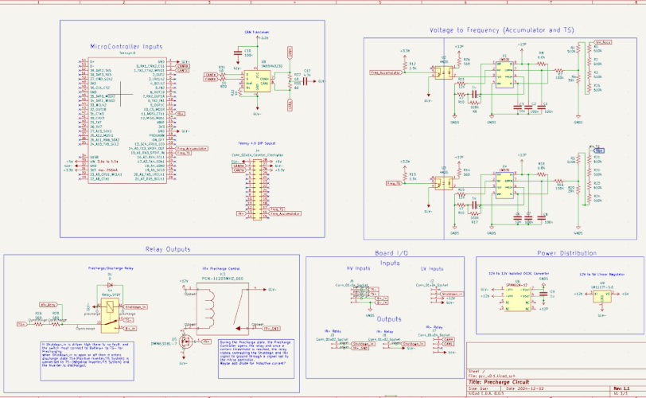
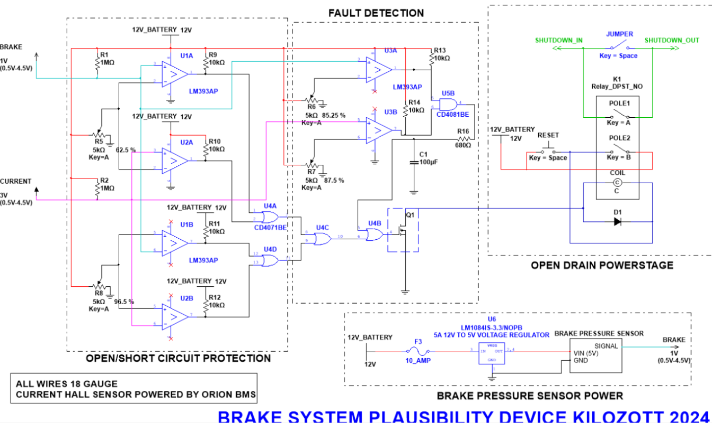
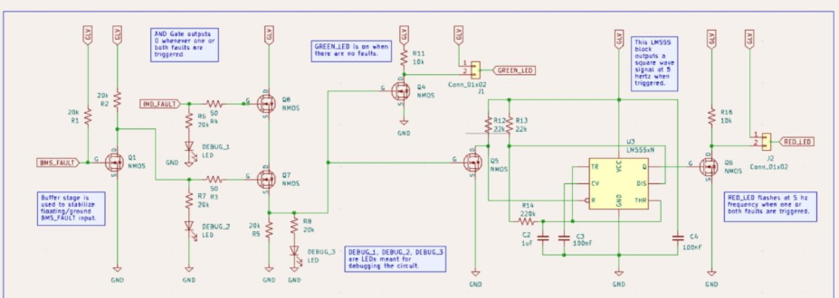
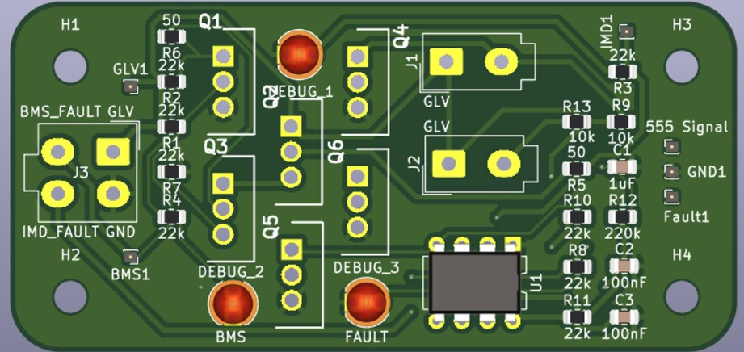
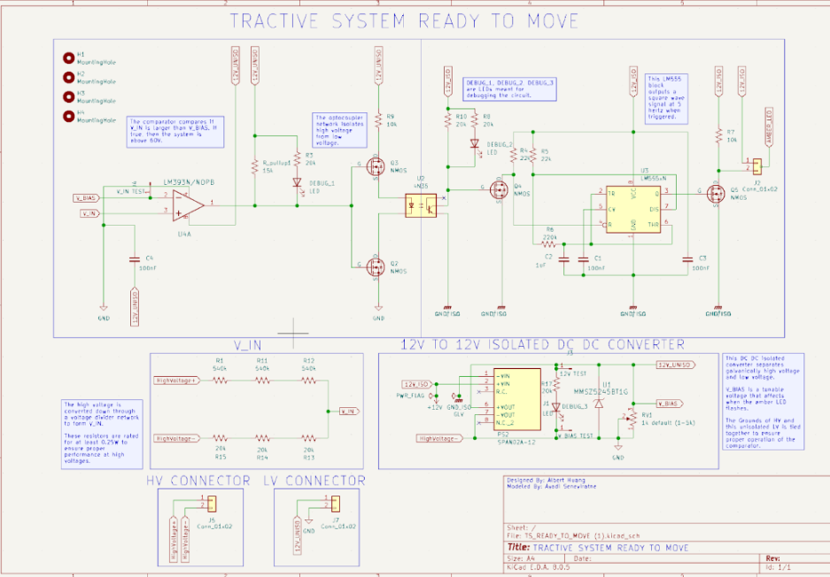
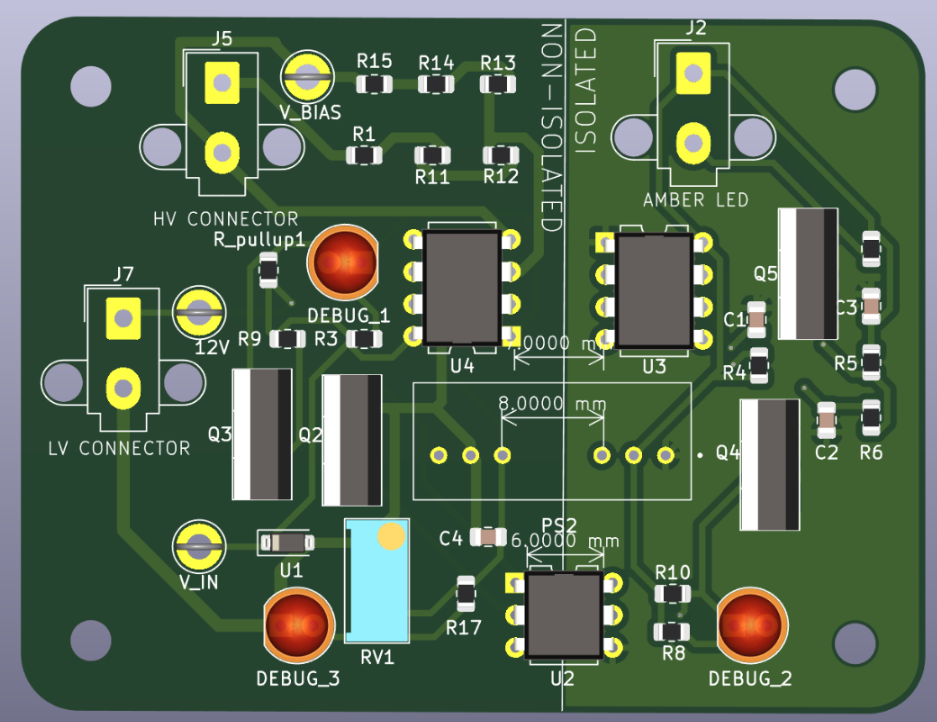

# Kilozott Electronics Build Book 2025

**Contributors:**

Click to expand

* Gabriel Schoene – ‘26 (gabeemail@email.com)
* Natalie Perrochon – ‘26 (perrochon.natalie@gmail.com)
* Albert Huang - '27 (alberyh1@uci.edu)

---

## Table of Contents

Click to expand

- [Team Overview](#team-overview)
  - [History](#history)
  - [Kilozott](#kilozott)
- [Electronics-Relevant Rules](#electronics-relevant-rules)
  - [Motivation](#motivation)
  - [Changes for 2026](#key-changes-for-2026)
  - [Important Rules](#global-relevant-rules)
- [Electronics Functionality](#electronics-functionality)
  - [System Overview](#system-overview)
  - [Brief Subsystem Overview](#brief-subsystem-overview)
- [Tractive System Operations](#tractive-system-operations)
  - [Accumulator Battery Pack](#accumulator-battery-pack)
  - [Precharge / Discharge Circuit](#precharge--discharge-circuit)
  - [High-Voltage Power Delivery Components](#high-voltage-power-delivery-components)
  - [Inverter](#inverter)
  - [Motor](#motor)
- [Tractive System Safety](#tractive-system-safety)
  - [Shutdown System](#shutdown-system)
  - [Shutdown Latch](#shutdown-latch)
  - [Brake System Plausibility Device](#brake-system-plausibility-device)
  - [Battery Management System](#battery-management-system)
  - [Insulation Monitoring Device](#insulation-monitoring-device)
  - [Emergency Stops & Switches](#emergency-stops--switches)
  - [Interlocks](#interlocks)
- [Driver Interface](#driver-interface)
  - [Tractive System Status Indicator](#tractive-system-status-indicator)
  - [TS RTM (Ready-to-Move)](#ts-rtm)
  - [Ready-to-Drive Sound](#ready-to-drive-sound)
  - [Dashboard & Displays](#dashboard--displays)
  - [Accelerator Pedal Position Sensors](#accelerator-pedal-position-sensors)
  - [Central Control Module](#central-control-module)
  - [Sensor Networks](#sensor-networks)
- [Harnessing and Power Distribution](#harnessing-and-power-distribution)
  - [GLV System](#glv-system)
  - [Power Distribution Board](#power-distribution-board)
  - [CAN Bus Communication](#can-bus-communication)
  - [Subsystem Wiring](#subsystem-wiring)
- [Cooling](#cooling)
  - [Cooling Components](#cooling-components)
- [Appendix](#appendix)

---

## Team Overview

### History

#### Kilozott
Kilozott is the competition car that was designed in the 2024-2025 cycle.

---

## Electronics-Relevant Rules

### Motivation
The car needs to be rules-compliant in order to race in the competition. Before the dynamic events, there are technical inspections that scrutinize every aspect of the car to ensure it is safe and adheres to the competition rules for that year. If any component fails, then the team is prohibited from racing. This includes a “rain test”, which sprays the car with water to ensure components are watertight.

Kilozott’s electronics were designed based on the 2024-2025 rules. Changes may be needed to become compliant with 2025-2026 rules.

**Download 2026 rules here:** [FSAE_Rules_2026_V1.pdf](BuildBookSupport/FSAE_Rules_2026_V1.pdf)

### Key Changes for 2026
> **ACTION ITEM:** Copy paste key changes and highlight differences. For each change explain what that might imply & link relevant sections.

### Global Relevant Rules
This is not a comprehensive list but rather cherry-picked for convenience. These rules apply to the entire electronics system. For circuit specific rules, refer to the detailed documentation sections below. 

To ensure complete compliance, always refer to the comprehensive FSAE rulebook.

#### Global Rule 1
> **[Content Placeholder]**

---

## Electronics Functionality

### System Overview
We break the electronics system down into 5 main categories that address different scopes of the overall functionality:

1.  Tractive System Operations
2.  Tractive System Safety
3.  Driver Interface
4.  Harnessing and Power Distribution
5.  Cooling

### Brief Subsystem Overview

<strong>Tractive System Operations</strong> – high-voltage power path from accumulator to motor.

Tractive System Operations covers every component used to deliver tractive energy from the accumulator to the inverter and ultimately to the motor.

- [Accumulator Battery Pack](#accumulator-battery-pack)
- [Precharge / Discharge Circuit](#precharge--discharge-circuit)
- [High-Voltage Power Delivery Components](#high-voltage-power-delivery-components)
- [Inverter](#inverter)
- [Motor](#motor)

<strong>Tractive System Safety</strong> – mandated protection, monitoring, and shutdown circuits.

Tractive System Safety includes all FSAE-required hardware that monitors, protects, or shuts down the tractive system when a fault occurs.

- [Shutdown System](#shutdown-system)
- [Shutdown Latch](#shutdown-latch)
- [Brake System Plausibility Device](#brake-system-plausibility-device)
- [Battery Management System](#battery-management-system)
- [Insulation Monitoring Device](#insulation-monitoring-device)
- [Emergency Stops & Switches](#emergency-stops--switches)
- [Interlocks](#interlocks)

<strong>Driver Interface</strong> – everything a driver touches, sees, or hears during operation.

Driver Interface spans the feedback and controls presented to the driver (TSSI, RTDS, dashboards, pedals, CAN-fed signals for brakes, accelerator, wheel speed, etc.).

- [Tractive System Status Indicator](#tractive-system-status-indicator)
- [TS RTM (Ready-to-Move)](#ts-rtm)
- [Ready-to-Drive Sound](#ready-to-drive-sound)
- [Dashboard & Displays](#dashboard--displays)
- [Accelerator Pedal Position Sensors](#accelerator-pedal-position-sensors)
- [Central Control Module](#central-control-module)
- [Sensor Networks](#sensor-networks)

<strong>Harnessing & Power Distribution</strong> – GLV power, bus architecture, and wiring practices.

This category documents low-voltage power delivery, CAN distribution, and subsystem wiring conventions that keep signals reliable.

- [GLV System](#glv-system)
- [Power Distribution Board](#power-distribution-board)
- [CAN Bus Communication](#can-bus-communication)
- [Subsystem Wiring](#subsystem-wiring)

<strong>Cooling</strong> – thermal management for electronics and high-power components.

Cooling content and component list are still being developed.

- [Cooling Components](#cooling-components) *(to be completed)*

Detailed documentation for each area lives in the dedicated sections that follow.

---

## Tractive System Operations

<strong>Accumulator Battery Pack</strong>

Document pack layout, cell chemistry, critical sensors, and how tractive and GLV domains interface. Include links to schematics, AIR wiring, and service procedures.

#### Overview
> _To be completed._

#### Functionality
> _To be completed._

#### System Block Diagram
> _To be completed._

#### Schematic / PCB
> _To be completed._

#### Subcomponents
> _To be completed._

#### Key Design Decisions
> _To be completed._

#### Mechanical Interface
> _To be completed._

#### Testing Instructions
> _To be completed._

#### Notes for Iteration
> _To be completed._

<strong>Precharge / Discharge Circuit</strong>

Capture resistor sizing, timing logic, controller firmware, and test procedures that verify current ramps and discharge compliance.

#### Overview
The Precharge Board (PCC) manages the critical startup sequence connecting high voltage (HV) from the accumulator to the inverter. Its primary purpose is to prevent massive inrush currents—which could weld contactors or damage components—by slowly charging the inverter’s large DC-link capacitors before the main Accumulator Isolation Relays (AIRs) close.

The PCC handles both **precharge** and **discharge** functions on a single board. It is a microcontroller-based controller that measures accumulator and tractive-system (TS) bus voltages, decides system state, and controls the precharge/discharge relays.

#### Functionality
**Voltage Measurement & Filtering:**
The board measures Accumulator voltage and Tractive System (TS) voltage using two **voltage-to-frequency (V/F) converters**.
1.  The V/F converters produce pulse trains where frequency corresponds to voltage.
2.  The microcontroller counts these pulses to reconstruct the voltage values.
3.  Readings are processed through **software low-pass filters** to reject jitter and noise before being used in control logic.

**Relay & Path Control:**
-   **IR+ Relay Control:** The microcontroller outputs a signal to drive a MOSFET, which energizes relay **K3 (IR relay)**. This closes the main precharge path to the Tractive System.
-   **Path Selection (Precharge vs. Discharge):** A **SPDT relay**, enabled by the shutdown circuit daisy chain, selects between the precharge path and the discharge path.
    -   **Precharge Path:** Connects the precharge resistor to slowly charge the bus.
    -   **Discharge Path:** Connects the discharge resistor to bleed energy from the bus.
-   **Resistors:** The network uses an effective resistance of **1000 Ω** for both precharge and discharge. These resistors are always connected whenever the shutdown circuit is live, resulting in continuous passive power draw that must be managed.

**Software State Machine:**
The system logic is driven by a finite-state machine (FSM) communicating status over CAN:
1.  **STATE_STANDBY:** System is idle and safe.
2.  **STATE_PRECHARGE:** Slowly charges TS bus via the precharge path. Monitors voltage rise; if too slow or if accessory voltage drops, it aborts to DISCHARGE.
3.  **STATE_DISCHARGE:** Discharges TS bus via the discharge path. Returns to STANDBY when TS voltage ≈ 0V. Also drives `SHUTDOWN_CTRL_PIN` low to disable the system.
4.  **STATE_ONLINE:** TS is fully charged and operational. Transitions to DISCHARGE if accessory voltage falls below threshold.
5.  **STATE_ERROR:** Fault condition. Discharges the bus if safe, otherwise handles fault logging.
6.  **STATE_UNDEFINED:** Initial state before valid voltage history is available.

#### System Block Diagram
> _To be completed._

#### Schematic / PCB

#### Subcomponents
> _To be completed._

#### Key Design Decisions
-   **V/F Converters vs. ADC:** Used V/F converters for voltage measurement instead of direct ADC, likely for noise immunity or isolation considerations.
-   **Microcontroller-Driven Sequencing:** All sequencing (standby → precharge → online → discharge) is software-defined, allowing flexible tuning of timing and thresholds.
-   **Shared Resistor Path:** A single SPDT relay switches between precharge and discharge legs, simplifying the high-voltage path.
-   **Software Filtering:** Jitter and noise are handled in firmware filters rather than heavy analog filtering.
-   **Explicit Error Handling:** Distinct ERROR and UNDEFINED states aid in debugging and ensure the system fails safely.

#### Mechanical Interface
> _To be completed._

#### Testing Instructions
> _To be completed._

#### Notes for Iteration
-   **Fix Pin Swap:** The current schematic has `B+_in` and `TS+` flipped; this must be corrected in the next board revision.
-   **Quantify Passive Power:** Since precharge resistors are always connected when the Shutdown Circuit (SDC) is live, the continuous power dissipation must be measured and documented.
-   **Validate 1000 Ω vs. Capacitance:** Confirm the 1000 Ω resistance provides the correct precharge time constant ($\tau$) for the actual pack capacitance.
-   **Separate Resistors:** Consider using separate resistors for precharge and discharge to optimize each function independently.
-   **Voltage Follower:** Use a voltage follower for better reading of TS and Accumulator voltages.
-   **OP AMP:** Add an OP AMP after the VFC for better measurement (check VFC datasheet for sample schematic)

<strong>High-Voltage Power Delivery Components</strong>

List contactors, isolation relays, HV cabling, shielding, and any inline measurement devices used to deliver power downstream.

#### Overview
> _To be completed._

#### Functionality
> _To be completed._

#### System Block Diagram
> _To be completed._

#### Subcomponents
> _To be completed._

#### Key Design Decisions
> _To be completed._

#### Mechanical Interface
> _To be completed._

#### Testing Instructions
> _To be completed._

#### Notes for Iteration
> _To be completed._

<strong>Inverter</strong>

Summarize inverter model, configuration parameters, CAN controls, and integration with the central control module.

#### Overview
> _To be completed._

#### Functionality
> _To be completed._

#### System Block Diagram
> _To be completed._

#### Schematic / PCB
> _To be completed._

#### Subcomponents
> _To be completed._

#### Key Design Decisions
> _To be completed._

#### Mechanical Interface
> _To be completed._

#### Testing Instructions
> _To be completed._

#### Notes for Iteration
> _To be completed._

<strong>Motor</strong>

Include nameplate data, sensor feedback (resolver/Halls), cooling needs, and mechanical mounting notes.

#### Overview
> _To be completed._

#### Functionality
> _To be completed._

#### System Block Diagram
> _To be completed._

#### Subcomponents
> _To be completed._

#### Key Design Decisions
> _To be completed._

#### Mechanical Interface
> _To be completed._

#### Testing Instructions
> _To be completed._

#### Notes for Iteration
> _To be completed._

---

## Tractive System Safety

<strong>Shutdown System</strong>

Map the complete safety loop path, including connectors, voltage levels, and triggers that open AIRs.

#### Overview
> _To be completed._

#### Functionality
> _To be completed._

#### System Block Diagram
> _To be completed._

#### Schematic / PCB
> _To be completed._

#### Subcomponents
> _To be completed._

#### Key Design Decisions
> _To be completed._

#### Mechanical Interface
> _To be completed._

#### Testing Instructions
> _To be completed._

#### Notes for Iteration
> _To be completed._

<strong>Shutdown Latch</strong>

Explain the latching logic, reset behavior, and compliance considerations per FSAE rules.

#### Overview
The shutdown latch circuit is a safety-critical board that opens the high-voltage tractive system shutdown chain when a fault is detected or a shutdown switch is actuated. It acts as a gatekeeper within the larger shutdown system, implementing three detection stages in series:

1.  **BSPD** (Brake System Plausibility Device) fault detection
2.  **IMD** (Insulation Monitoring Device) fault detection
3.  **BMS** (Battery Management System) fault detection

Each stage can independently interrupt the daisy-chained shutdown line. This ensures that **any single fault** forces the tractive system off, protecting the driver, team, and vehicle from high-voltage hazards.

#### Functionality
**Logical Behavior:**
-   **Normal Operation:** With GLVMS applied and no faults present, all three stages energize their respective relays. This closes the contacts, maintaining continuity through the shutdown daisy chain to the inertial switch.
-   **Fault Condition:** If any of the monitored systems (BSPD, IMD, or BMS) enters a "fault" state, its corresponding stage de-energizes its relay. This opens that segment of the chain, breaking the tractive system shutdown loop.
-   **Manual Control:** Each stage includes a manual shutdown/reset switch and debug LEDs for visual indication and testing.

**Inputs:**
-   **BSPD FAULT:** Open-drain; active when line floats (Normal: GND, Triggered: floating).
-   **IMD FAULT:** Push-pull; active low to GND (Normal: 12V, Triggered: GND).
-   **BMS FAULT:** Open-drain; active when line floats (Normal: GND, Triggered: floating).
-   **GLVMS:** GLV supply / enable input powering the shutdown circuit.

**Output:**
-   **Inertial Switch Output:** The signal passed to the next stage of the shutdown daisy chain.

#### System Block Diagram
> _To be completed._

#### Schematic / PCB

#### Subcomponents
> _To be completed._

#### Key Design Decisions
-   **Three-Stage Daisy-Chain Architecture:** BSPD, IMD, and BMS monitoring are independent yet logically ANDed in series. A fault in any one stage breaks the entire chain.
-   **Relays as Safety Elements:** Uses DPST NO (Double Pole Single Throw, Normally Open) relays for each stage to provide clear galvanic isolation and redundant contacts/routing options. This mechanical separation is ideal for safety-critical applications.
-   **Mixed Fault Signaling:** Designed to handle disparate signaling standards—IMD’s push-pull (12V/GND) vs. BSPD/BMS’s open-drain (GND/Float)—and consistently trigger the relays.
-   **Protection:** Flyback diodes on each relay coil prevent high-voltage spikes that could damage adjacent circuitry or cause false logic triggers.
-   **Debugability:** Includes per-stage debug LEDs and clearly labeled test points (e.g., DEBUG 1A/1B) to simplify bring-up and verify continuity/timing.

#### Mechanical Interface
> _To be completed._

#### Testing Instructions
**1. Fault Input Verification**
For each fault source (IMD, BMS, BSPD), perform the following:
1.  **Connect Input:** Attach the relevant fault source to its input pin.
2.  **Verify Logic:** Measure voltage at the relay coil to confirm the circuit correctly interprets the fault signal (Normal vs. Fault).
3.  **Check Indicators:** Confirm the debug LED turns ON/OFF as expected.
4.  **Verify Continuity:**
    -   *No Fault:* Check continuity across the DEBUG test points (e.g., DEBUG 1A ↔ 1B). The circuit should be closed.
    -   *Fault Injected:* Force a fault (e.g., disconnect sensor or trip IMD). Confirm the relay opens and continuity is broken.

**2. Timing Validation**
1.  **Setup:** Power the board (GLVMS) so the shutdown chain is closed.
2.  **Trigger Fault:** Instantly apply a fault condition.
3.  **Measure Latency:** Record the time from fault assertion to the moment the relay contacts open (breaking the chain).
4.  **Repeat:** Run this test at least 5 times for each fault source (BSPD, IMD, BMS) to get an average.
5.  **Pass Criteria:** The relay opening time must be **< 5 seconds** for every scenario.

#### Notes for Iteration
> _To be completed._

<strong>Brake System Plausibility Device</strong>

Provide thresholds, logic flow, and fault-handling steps that ensure throttle/brake conflicts are mitigated.

#### Overview
The **Brake System Plausibility Device (BSPD)** is a fully analog, non-programmable safety circuit that monitors the brake sensor and a current sensor. It asserts a **BSPD_FAULT** output when it detects unsafe or implausible conditions.

The circuit is partitioned into four main stages:
1.  **Stage 1 – Open Circuit Detection:** Detects if sensor signals indicate an open circuit or broken wire.
2.  **Stage 2 – Short Circuit Detection:** Intended to detect shorted sensor lines. *(Note: Current implementation likely needs redesign).*
3.  **Stage 3 – Hard Brake Detection:** Detects simultaneous high braking and high current (acceleration) signals.
4.  **Stage 4 – Logic and I/O:** ORs all faults, inverts the signal, and drives the open-drain fault output.

The design relies on comparators, logic gates, and discrete passives—rather than firmware—to strictly meet non-programmability and transparency requirements.

#### Functionality
**Inputs:**
-   **Brake Sensor:** Analog input representing brake pedal position (assumed 0–5V range).
-   **Current Sensor:** Analog input representing motor/inverter current or throttle-related current (assumed 0–5V range).

**Output:**
-   **BSPD_FAULT:** (Connector J1)
    -   *Normal:* High-impedance (open-drain); pulled up externally.
    -   *Fault:* Driven logic LOW, indicating a safety violation.

**Fault Conditions Addressed:**
-   **Open-Circuit (Stage 1):** Monitors brake/current signals for disconnects.
-   **Short-Circuit (Stage 2):** Monitors for shorts (requires validation/redesign).
-   **Hard Brake (Stage 3):** Triggers if both Brake and Current signals exceed thresholds simultaneously. Uses an RC filter (~70ms time constant) to ignore brief transients.
-   **Aggregation (Stage 4):** Combines all faults; asserts active-low output on BSPD_FAULT.

#### System Block Diagram
> _To be completed._

#### Schematic / PCB

#### Subcomponents
> _To be completed._

#### Key Design Decisions
-   **Fully Analog / Non-Programmable:** Implemented entirely with comparators and discrete logic for robustness and rule compliance.
-   **Stage-Based Architecture:** Modular design (Open, Short, Hard Brake) simplifies debugging; logical OR ensures any single fault triggers safety.
-   **Adjustable Thresholds:** Four potentiometers allow fine-tuning of reference voltages for Open/Short/Brake-High/Current-High thresholds. Documentation advises using a "detection margin" to back off setpoints.
-   **RC Filtering:** A ~70ms RC time constant on the Hard Brake output prevents false positives from noise or transient overlaps.
-   **Open-Drain Output:** Drives low on fault, floating otherwise—ideal for OR-ing multiple open-drain signals in a shared shutdown chain.

#### Mechanical Interface
> _To be completed._

#### Testing Instructions
> _To be completed._

#### Notes for Iteration
-   **Potentiometer Robustness:** Safety thresholds depend on wiper positions. Consider replacing single pots with fixed resistor networks + small trimmers to reduce failure risk.
-   **Test Points:** Add clearly labeled test pads for reference voltages on the PCB silkscreen.

<strong>Battery Management System</strong>

Document pack monitoring, balancing strategy, CAN messaging, and fault escalation to the shutdown loop.

#### Overview
> _To be completed._

#### Functionality
> _To be completed._

#### System Block Diagram
> _To be completed._

#### Schematic / PCB
> _To be completed._

#### Subcomponents
> _To be completed._

#### Key Design Decisions
> _To be completed._

#### Mechanical Interface
> _To be completed._

#### Testing Instructions
> _To be completed._

#### Notes for Iteration
> _To be completed._

<strong>Insulation Monitoring Device</strong>

Capture IMD thresholds, self-test requirements, and how faults propagate to TSSI/CCM.

#### Overview
> _To be completed._

#### Functionality
> _To be completed._

#### System Block Diagram
> _To be completed._

#### Schematic / PCB
> _To be completed._

#### Subcomponents
> _To be completed._

#### Key Design Decisions
> _To be completed._

#### Mechanical Interface
> _To be completed._

#### Testing Instructions
> _To be completed._

#### Notes for Iteration
> _To be completed._

<strong>Emergency Stops & Switches</strong>

List mechanical locations, wiring diagrams, and inspection steps for both cockpit and external E-stops.

#### Overview
> _To be completed._

#### Functionality
> _To be completed._

#### System Block Diagram
> _To be completed._

#### Subcomponents
> _To be completed._

#### Key Design Decisions
> _To be completed._

#### Mechanical Interface
> _To be completed._

#### Testing Instructions
> _To be completed._

#### Notes for Iteration
> _To be completed._

<strong>Interlocks</strong>

Describe service interlocks (TSMS, GLV enable, lid switches) and how they guarantee safe access to HV hardware.

#### Overview
> _To be completed._

#### Functionality
> _To be completed._

#### System Block Diagram
> _To be completed._

#### Subcomponents
> _To be completed._

#### Key Design Decisions
> _To be completed._

#### Mechanical Interface
> _To be completed._

#### Testing Instructions
> _To be completed._

#### Notes for Iteration
> _To be completed._

---

## Driver Interface

<strong>Tractive System Status Indicator</strong>

Summarize LED states, logic inputs, and regulatory requirements (steady green vs flashing red).

#### Overview
The Tractive System Status Indicator (TSSI) provides visual feedback on the safety status of the vehicle's critical monitoring systems. Its purpose is to output a **static green LED** if both the Battery Management System (BMS) and Insulation Monitoring Device (IMD) report no faults. If either system detects a fault, the TSSI drives a **flashing red LED** (using a 555 timer) to alert the driver and team, in compliance with FSAE regulations.

#### Functionality
**Inputs:**
-   **IMD_FAULT:** Logic-level signal (12V = Normal, 0V = Fault).
-   **BMS_FAULT:** Active-low/floating signal (0V or Floating = Fault); treated as active via pullup/inversion.
-   **GLV & GND:** Low-voltage supply and reference.

**Outputs:**
-   **GREEN_LED:** On solid when **no faults** are present.
-   **RED_LED:** Flashes at **~5 Hz** when IMD, BMS, or both report a fault.

**Behavior:**
-   **No Faults:** Input logic enables the "OK" path. Q4 drives the **Green LED ON**. The 555 timer block remains disabled (Red LED OFF).
-   **Any Fault:** Input logic disables the Green LED drive. The 555 timer is enabled, driving the **Red LED to flash at ~5 Hz**.

This logic provides a simple, rule-compliant abstraction: **Green = OK**, **Red Flashing = Fault**.

#### System Block Diagram
> _To be completed._

#### Schematic / PCB

#### Subcomponents
> _To be completed._

#### Key Design Decisions
-   **Simple Status Abstraction:** Compresses complex upstream fault signals (IMD/BMS) into a binary user-facing state (Green vs. Flashing Red).
-   **Discrete NMOS Logic:** Uses discrete NMOS pairs (Q7, Q8) as an AND gate and Q1 as an inverter instead of integrated logic ICs. (Note: Future revisions may replace this with dedicated ICs for cleaner timing).
-   **555 Timer Flasher:** Uses an LM555 timer for the 5 Hz flashing signal instead of a microcontroller, ensuring simple, non-programmable robustness.
-   **Ground-Switching LEDs:** Both Green and Red LEDs are driven in a low-side (ground-switching) configuration.

#### Mechanical Interface
> _To be completed._

#### Testing Instructions
**1. Fault Simulation:**
-   **No Faults:** Assert "no-fault" on both inputs. **Result:** Solid Green LED, Red LED Off.
-   **BMS Fault Only:** Simulate BMS fault (break wire/float). **Result:** Red LED flashes at ~5 Hz.
-   **IMD Fault Only:** Simulate IMD fault (drive low). **Result:** Red LED flashes at ~5 Hz.
-   **Both Faults:** Simulate simultaneous faults. **Result:** Red LED flashes at ~5 Hz.

**2. Troubleshooting:**
-   If behavior is incorrect, check the on-board debug LEDs (`DEBUG_1–3`) and measure voltages at key logic nodes (AND gate output, 555 trigger).

**3. Light Output Verification:**
-   Measure luminous output to ensure brightness meets competition visibility specifications.

#### Notes for Iteration
-   **Logic Optimization:** Switch towards a gate-induced logic system to reduce board space (replacing discrete MOSFETs) and potentially improve timing.
-   **Simplify Logic:** Remove redundant "inverter-then-inverter" logic stages.
-   **Switching Config:** Confirm whether to continue using power-ground switching for the LEDs.
-   **Efficiency:** Investigate parts with lower power consumption to improve overall efficiency.
-   **Input Protection:** Add fuses (overcurrent), TVS diodes (ESD/surge), and Schmitt triggers on inputs to improve noise immunity and prevent false triggering.
-   **Capacitive Filtering:** Add decoupling capacitors to inputs/outputs for better noise robustness in the vehicle environment.

<strong>TS RTM (Ready-to-Move)</strong>

The TS RTM board is a high-voltage monitor and indicator that signals when the tractive system is energized (>60V).

#### Overview
The **TS RTM (Tractive System Ready-To-Move)** board is a critical safety indicator. Its primary job is to monitor the high-voltage (HV) bus and drive a flashing AMBER indicator (and a speaker Ready to Move Sound) whenever the voltage exceeds **60 V**. This warns anyone near the vehicle that the tractive system is energized.

Crucially, it maintains **galvanic isolation** between the high-voltage domain and the low-voltage indicator/logic domain, using an isolated 12V–12V DC-DC converter and an optocoupler.

#### Functionality
**Inputs:**
-   **HighVoltage+ / HighVoltage−:** High-voltage sense inputs (up to ≈460 V).
-   **12V:** Low-voltage supply input (GLV 12 V).
-   **GND:** Low-voltage ground.

**Outputs:**
-   **AMBER LED:** Main visual indicator, designed to flash at ~5 Hz when HV > 60 V.
-   **SPEAKER:** Intended audible output (currently not implemented; may rely solely on AMBER LED).

**Behavior:**
1.  **Scaling:** The HV input is scaled down by a resistive divider (approx. 460V → 12V).
2.  **Comparison:** A comparator checks this scaled voltage ($V_{IN}$) against a bias reference ($V_{BIAS}$) set by a potentiometer.
3.  **Trigger:**
    -   If $V_{IN} > V_{BIAS}$ (interpreted as HV > 60 V):
    -   Comparator output goes HIGH.
    -   NMOS network turns on and drives an optocoupler.
4.  **Indication:** The optocoupler triggers a 555 timer on the isolated low-voltage side. The 555 is configured as an astable oscillator (~5 Hz), which flashes the AMBER LED.

#### System Block Diagram
> _To be completed._

#### Schematic / PCB

#### Subcomponents
> _To be completed._

#### Key Design Decisions
-   **60 V Threshold:** The voltage divider and comparator trip point are tuned so the indicator triggers exactly when HV exceeds 60 V, per safety regulations.
-   **High-Value Resistive Divider:** Uses **540 kΩ** resistors to minimize current draw from the HV bus and keep power dissipation safely within rating (0.25 W), even at several hundred volts.
-   **Strong Isolation Strategy:** Combines an isolated 12V–12V DC-DC converter (PS1) with an optocoupler (4N35) to ensure the HV domain is doubly isolated from the LV indicator circuitry.
-   **Adjustable Bias:** A potentiometer (RV1) allows field calibration of the exact 60 V threshold, compensating for component tolerances in the divider.
-   **555 Timer Flasher:** Uses a simple, robust 555 timer for the 5 Hz flashing signal instead of a microcontroller, reducing complexity and potential failure modes.

#### Mechanical Interface
> _To be completed._

#### Testing Instructions
**Safety & Setup:**
-   Ensure HV and LV systems share appropriate reference grounding.
-   **Wear appropriate PPE** and follow all high-voltage safety procedures.

**1. Bench HV Simulation:**
-   Use a controllable DC power supply (~100 V) to simulate HV input.
-   Connect supply to `HighVoltage+` / `HighVoltage−`.

**2. Threshold Calibration:**
-   Start from 0 V and slowly raise the HV supply.
-   Observe the AMBER LED.
-   When the LED begins flashing, check the supply voltage. Adjust **RV1** so the LED starts flashing at exactly **60 V**.

**3. Range & Stress Check:**
-   Sweep the supply voltage across its usable range (0 V → Max).
-   Verify the LED only flashes above the threshold.
-   Check for signs of overheating (smell, hot components).

**4. System Integration:**
-   Connect RTM to the actual tractive system HV.
-   Turn HV on/off. Confirm the LED flashes when HV > 60 V and turns off otherwise.

**5. Compliance Check:**
-   Verify the AMBER LED color, flash rate (~5 Hz), and duty cycle meet FSAE specifications.

#### Notes for Iteration
> _To be completed._

<strong>Ready-to-Drive Sound</strong>

Detail the audio hardware, trigger logic, and timing that signals TS-ready status to the driver.

#### Overview
> _To be completed._

#### Functionality
> _To be completed._

#### System Block Diagram
> _To be completed._

#### Schematic / PCB
> _To be completed._

#### Subcomponents
> _To be completed._

#### Key Design Decisions
> _To be completed._

#### Mechanical Interface
> _To be completed._

#### Testing Instructions
> _To be completed._

#### Notes for Iteration
> _To be completed._

<strong>Dashboard & Displays</strong>

Outline display hardware, UI layout, data logging, and firmware hooks to the CCM.

#### Overview
> _To be completed._

#### Functionality
> _To be completed._

#### System Block Diagram
> _To be completed._

#### Schematic / PCB
> _To be completed._

#### Subcomponents
> _To be completed._

#### Key Design Decisions
> _To be completed._

#### Mechanical Interface
> _To be completed._

#### Testing Instructions
> _To be completed._

#### Notes for Iteration
> _To be completed._

<strong>Accelerator Pedal Position Sensors</strong>

Document redundant APPS channels, calibration process, and plausibility checks.

#### Overview
> _To be completed._

#### Functionality
> _To be completed._

#### System Block Diagram
> _To be completed._

#### Subcomponents
> _To be completed._

#### Key Design Decisions
> _To be completed._

#### Mechanical Interface
> _To be completed._

#### Testing Instructions
> _To be completed._

#### Notes for Iteration
> _To be completed._

<strong>Central Control Module</strong>

Capture firmware responsibilities, CAN interface details, and power sequencing logic.

#### Overview
> _To be completed._

#### Functionality
> _To be completed._

#### System Block Diagram
> _To be completed._

#### Schematic / PCB
> _To be completed._

#### Subcomponents
> _To be completed._

#### Key Design Decisions
> _To be completed._

#### Mechanical Interface
> _To be completed._

#### Testing Instructions
> _To be completed._

#### Notes for Iteration
> _To be completed._

<strong>Sensor Networks</strong>

List CAN IDs, sampling rates, and critical signals (brakes, wheel speed, steering, etc.) that inform driver feedback.

#### Overview
> _To be completed._

#### Functionality
> _To be completed._

#### System Block Diagram
> _To be completed._

#### Schematic / PCB
> _To be completed._

#### Subcomponents
> _To be completed._

#### Key Design Decisions
> _To be completed._

#### Mechanical Interface
> _To be completed._

#### Testing Instructions
> _To be completed._

#### Notes for Iteration
> _To be completed._

---

## Harnessing and Power Distribution

<strong>GLV System</strong>

Describe GLV battery specs, protection circuitry, grounding strategy, and maintenance notes.

#### Overview
> _To be completed._

#### Functionality
> _To be completed._

#### System Block Diagram
> _To be completed._

#### Schematic / PCB
> _To be completed._

#### Subcomponents
> _To be completed._

#### Key Design Decisions
> _To be completed._

#### Mechanical Interface
> _To be completed._

#### Testing Instructions
> _To be completed._

#### Notes for Iteration
> _To be completed._

<strong>Power Distribution Board</strong>

Document outputs, fuse/CB sizing, current sensing, and diagnostic interfaces.

#### Overview
> _To be completed._

#### Functionality
> _To be completed._

#### System Block Diagram
> _To be completed._

#### Schematic / PCB
> _To be completed._

#### Subcomponents
> _To be completed._

#### Key Design Decisions
> _To be completed._

#### Mechanical Interface
> _To be completed._

#### Testing Instructions
> _To be completed._

#### Notes for Iteration
> _To be completed._

<strong>CAN Bus Communication</strong>

Summarize bus topology, connector standards, termination strategy, and debugging workflows.

#### Overview
> _To be completed._

#### Functionality
> _To be completed._

#### System Block Diagram
> _To be completed._

#### Schematic / PCB
> _To be completed._

#### Subcomponents
> _To be completed._

#### Key Design Decisions
> _To be completed._

#### Mechanical Interface
> _To be completed._

#### Testing Instructions
> _To be completed._

#### Notes for Iteration
> _To be completed._

<strong>Subsystem Wiring</strong>

Capture harness segmentation, labeling conventions, strain relief methods, and shielding or twisted-pair requirements.

#### Overview
> _To be completed._

#### Functionality
> _To be completed._

#### System Block Diagram
> _To be completed._

#### Subcomponents
> _To be completed._

#### Key Design Decisions
> _To be completed._

#### Mechanical Interface
> _To be completed._

#### Testing Instructions
> _To be completed._

#### Notes for Iteration
> _To be completed._

---

## Cooling

<strong>Cooling Components</strong>

List pumps, radiators, manifolds, and sensors dedicated to electronics cooling. Include control logic, coolant specifications, and inspection intervals.

#### Overview
> _To be completed._

#### Functionality
> _To be completed._

#### System Block Diagram
> _To be completed._

#### Subcomponents
> _To be completed._

#### Key Design Decisions
> _To be completed._

#### Mechanical Interface
> _To be completed._

#### Testing Instructions
> _To be completed._

#### Notes for Iteration
> _To be completed._

---

## Appendix

### Learning Resources
* **Useful links for brushing up on relevant topics:** [Insert Links]
* **Rapidharness tutorial:** [Link]